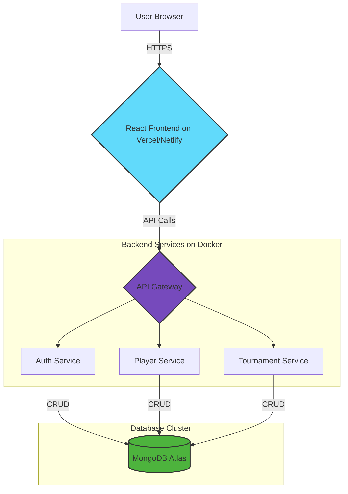

<div align="center">
  <!-- You can replace this placeholder with a custom banner you create -->
  

  <h1>Esports Club Management</h1>
  
  <p>A robust, all-in-one solution for managing esports teams, players, tournaments, and community engagement.</p>

  <!-- Shields.io Badges -->
  <a href="https://github.com/poVvisal/EsportClub_Managment/blob/main/LICENSE">
    
  </a>
  <a href="https://github.com/poVvisal/EsportClub_Managment/stargazers">
    
  </a>
  <a href="https://github.com/poVvisal/EsportClub_Managment/network/members">
    
  </a>
  <a href="https://github.com/poVvisal/EsportClub_Managment/issues">
    
  </a>
  <a href="[YOUR_CI_CD_WORKFLOW_LINK]">
    
  </a>
</div>

---

## 🚀 Live Preview & Screenshots

<div align="center">
  <p>Check out the live deployed application or see it in action below!</p>
  <a href="[YOUR_DEPLOYMENT_LINK_HERE]"><strong>➡️ Visit the Live Site</strong></a>
  <br><br>
  
  <!-- Replace this placeholder with a GIF or screenshot of your application -->
  
</div>

---

## ✨ Core Features

* **👤 Player & Team Management:** Maintain detailed rosters, track player statistics, and manage team compositions.
* **🏆 Tournament Scheduling:** Create, manage, and display tournament brackets (Single Elimination, Double Elimination).
* **📊 Match History & Analytics:** Log match results, track performance metrics, and view historical data.
* **🔒 Role-Based Access Control:** Pre-defined roles for Admins, Team Managers, and Players with specific permissions.
* **💬 Internal Communication:** [e.g., A dedicated dashboard or messaging system for teams.]
* **📈 User Dashboard:** Personalized dashboards for each user role to view relevant information at a glance.
* **🔐 Secure Authentication:** JWT-based authentication flow for secure access to the platform.

---

## 🛠️ Tech Stack & Tools

This project is built with a modern and scalable tech stack.

<div align="center">
  
</div>

| Component      | Technology                                    |
| :------------- | :-------------------------------------------- |
| **Frontend** | `[e.g., React, Vite, Tailwind CSS]`             |
| **Backend** | `[e.g., Node.js, Express.js]`                 |
| **Database** | `[e.g., MongoDB with Mongoose]`               |
| **Auth** | `[e.g., JSON Web Tokens (JWT)]`                 |
| **Testing** | `[e.g., Jest, Supertest]`                     |
| **Deployment** | `[e.g., Docker, Vercel, AWS]`                 |

---

## 🏗️ System Architecture

This application follows a **[e.g., Monolithic or Microservices]** architecture. The diagram below provides a high-level overview of the system's components and their interactions.


*Diagram: High-level system architecture.*

---

## ⚙️ Getting Started

To get a local copy up and running, follow these simple steps.

### Prerequisites

* **Node.js** (`v18.x` or higher)
* **NPM** or **Yarn**
* **MongoDB** (`v6.x` or a running cluster URI)
* **Docker & Docker Compose** (for Docker setup)

### Installation

<details>
<summary><strong>Option 1: Local Development Setup</strong></summary>

1.  **Clone the repository**
    ```sh
    git clone [https://github.com/poVvisal/EsportClub_Managment.git](https://github.com/poVvisal/EsportClub_Managment.git)
    cd EsportClub_Managment
    ```

2.  **Setup Backend**
    ```sh
    cd server # or your backend folder name
    npm install
    ```

3.  **Create a `.env` file** in the `/server` directory (copy from `.env.example`)
    ```sh
    cp .env.example .env
    ```
    *Update `.env` with your credentials (e.g., database connection string, JWT secret).*
    ```env
    DATABASE_URL="your_mongodb_connection_string"
    JWT_SECRET="your_strong_jwt_secret"
    PORT=5001
    ```

4.  **Setup Frontend**
    ```sh
    cd ../client # or your frontend folder name
    npm install
    ```

5.  **Run the application**
    * In the `/server` terminal:
        ```sh
        npm run dev
        ```
    * In the `/client` terminal:
        ```sh
        npm run dev
        ```

</details>

<details>
<summary><strong>Option 2: Docker Setup</strong></summary>

1.  **Clone the repository** and navigate to the root
    ```sh
    git clone [https://github.com/poVvisal/EsportClub_Managment.git](https://github.com/poVvisal/EsportClub_Managment.git)
    cd EsportClub_Managment
    ```

2.  **Ensure your `.env` file** is correctly configured in the `/server` directory as shown in the local setup.

3.  **Build and run** the containers in detached mode
    ```sh
    docker-compose up -d --build
    ```

4.  The application should now be running!
    * **Frontend:** `http://localhost:[YOUR_FRONTEND_PORT]`
    * **Backend:** `http://localhost:[YOUR_BACKEND_PORT]`

</details>

---

## 👨‍💻 Usage & API

### Mock Credentials

The application supports multiple user roles. You can use the following mock credentials to test the platform:

| Role           | Email                 | Password        |
| :------------- | :-------------------- | :-------------- |
| **Admin** | `admin@example.com`   | `adminpassword` |
| **Team Manager** | `manager@example.com` | `managerpass`   |
| **Player** | `player@example.com`  | `playerpass`    |

### Key API Endpoints

The API is documented using **[e.g., Swagger or Postman]**. Key routes include:

| Method | Endpoint             | Description                       | Auth Required |
| :----- | :------------------- | :-------------------------------- | :------------ |
| `POST` | `/api/auth/register` | Register a new user.              | No            |
| `POST` | `/api/auth/login`    | Authenticate a user and get JWT.  | No            |
| `GET`  | `/api/teams`         | Get a list of all teams.          | Yes           |
| `GET`  | `/api/teams/:id`     | Get details for a specific team.  | Yes           |
| `POST` | `/api/tournaments`   | Create a new tournament.          | Admin/Manager |

---

## 🤝 Contributing

Contributions are what make the open-source community such an amazing place to learn, inspire, and create. Any contributions you make are **greatly appreciated**.

Please follow these steps to contribute:

1.  Fork the Project
2.  Create your Feature Branch (`git checkout -b feature/AmazingFeature`)
3.  Commit your Changes (`git commit -m 'Add some AmazingFeature'`)
4.  Push to the Branch (`git push origin feature/AmazingFeature`)
5.  Open a Pull Request

Please make sure to update tests as appropriate.

---

## 📜 License

Distributed under the MIT License. See `LICENSE` for more information.

---

## ✍️ Author & Contact

**Visal Pov**

<p>
  <a href="mailto:P.visal6927@gmail.com">
    
  </a>
  <a href="https://github.com/poVvisal">
    
  </a>
  <a href="[YOUR_LINKEDIN_URL]">
    
  </a>
</p>
